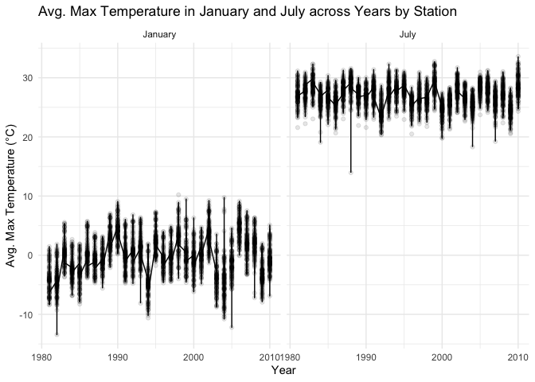
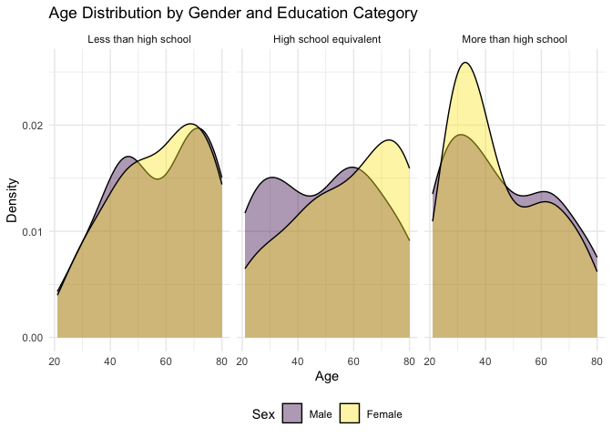
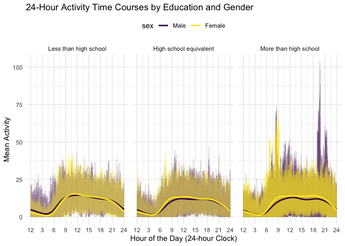
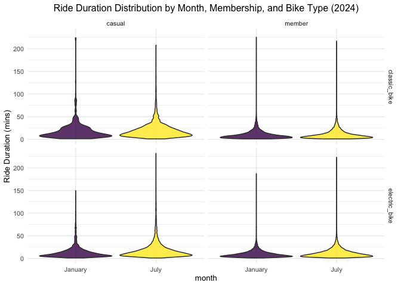

P8015_hw3_dw3093
================
Katherine Wang
2024-10-13

## Question 1

Summary of the dataset This dataset contains `nrow(ny_noaa)` rows and
`ncol(ny_noaa)` columns. This dataset contains 2,595,176 rows and 7
columns The date of observation, ranging from 1981-01-01 to 2010-12-31.

Key variables include: - weather station ID (`id`) - date of observation
(`date`) - precipitation in tenths (mm) (`prcp`) - snowfall (mm)
(`snow`) - snow depth (mm) (`snwd`) - maximum temperature (tenths of
degrees C) (`tmax`) - minimum temperature (tenths of degrees C) (`tmin`)

The `tmax` and `tmin` are set to be character variables, so they need to
converse to numeric variables in the future step.

Through the missing value check, there are a great amount missing (NAs)
values as shown on the table: id date prcp snow snwd tmax tmin 0 0
145838 381221 591786 1134358 1134420

    ##       id                 date                 prcp               snow       
    ##  Length:2595176     Min.   :1981-01-01   Min.   :    0.00   Min.   :  -13   
    ##  Class :character   1st Qu.:1988-11-29   1st Qu.:    0.00   1st Qu.:    0   
    ##  Mode  :character   Median :1997-01-21   Median :    0.00   Median :    0   
    ##                     Mean   :1997-01-01   Mean   :   29.82   Mean   :    5   
    ##                     3rd Qu.:2005-09-01   3rd Qu.:   23.00   3rd Qu.:    0   
    ##                     Max.   :2010-12-31   Max.   :22860.00   Max.   :10160   
    ##                                          NA's   :145838     NA's   :381221  
    ##       snwd             tmax              tmin        
    ##  Min.   :   0.0   Min.   :-389.0    Min.   :-594.0   
    ##  1st Qu.:   0.0   1st Qu.:  50.0    1st Qu.: -39.0   
    ##  Median :   0.0   Median : 150.0    Median :  33.0   
    ##  Mean   :  37.3   Mean   : 139.8    Mean   :  30.3   
    ##  3rd Qu.:   0.0   3rd Qu.: 233.0    3rd Qu.: 111.0   
    ##  Max.   :9195.0   Max.   : 600.0    Max.   : 600.0   
    ##  NA's   :591786   NA's   :1134358   NA's   :1134420

Convert tmax and tmin to numeric variables.

    ## # A tibble: 282 × 2
    ##     snow       n
    ##    <int>   <int>
    ##  1     0 2008508
    ##  2    NA  381221
    ##  3    25   31022
    ##  4    13   23095
    ##  5    51   18274
    ##  6    76   10173
    ##  7     8    9962
    ##  8     5    9748
    ##  9    38    9197
    ## 10     3    8790
    ## # ℹ 272 more rows

The most commonly observed value for snowfall is 0, which indicates that
no snowfall occurred on the majority of days in this dataset that is
2,008,508 observations. This is followed by a large number of NAs,
totaling 381,221 observations, which suggests that snowfall data was not
recorded or available for these entries. Most days in New York State do
not experience snowfall, especially during non-winter months. Therefore,
it is expected that the majority of observations would record 0 for
snowfall, representing days without snow.

``` r
ny_noaa |>
  group_by(id,year,month)|>
  filter(month %in% c(1, 7)) |>
  mutate(
    month = factor(month(date), 
                   levels = c(1, 7), 
                   labels = c("January", "July"))
    ) |>
  summarise(avg_tmax = mean(tmax, na.rm = TRUE))|>
  ggplot(aes(x = year, y = avg_tmax))+
  geom_point(alpha = .1)+
  geom_line()+
  facet_grid(.~month)+
  labs( title = "Avg. Max Temperature in January and July across Years by Station",
    x = "Year",
    y = "Avg. Max Temperature (°C)")+ 
  theme_minimal() + 
  theme(legend.position = "top")
```

    ## `summarise()` has grouped output by 'id', 'year'. You can override using the
    ## `.groups` argument.

    ## Warning: Removed 5970 rows containing missing values or values outside the scale range
    ## (`geom_point()`).

<!-- --> The
two-panel plot shows that avg. max temperatures in January exhibit more
variability across stations and years ranging from about -10°C to 10°C,
while July temperatures are relatively stable, consistently around 25°C
to 35°C. In January more fluctuations are visible, with few potential
outliers like the lowest temperature is about 13°C in around 1982. July
shows minimal variation, the temperature is quite consistency warm
across the years, but still contains few outliers, like the lowest
temperature is about 14°C in around 1988.

``` r
hexbin_plot=
  ny_noaa|>
  ggplot(aes(x = tmin, y = tmax))+
  geom_hex()+
  labs(
    x = "minimum temperature(°C)",
    y = "maximum temperature(°C)",
    )+
    theme_minimal()

density_plot = 
  ny_noaa|>
  filter(snow>0, snow<100)|>
  ggplot(aes(x = snow, y = as.factor(year))) + 
  geom_density_ridges()

combine_plot =
  hexbin_plot + density_plot
 
print(combine_plot)
```

    ## Warning: Removed 1136276 rows containing non-finite outside the scale range
    ## (`stat_binhex()`).

    ## Picking joint bandwidth of 3.76

<!-- --> The
hexbin plot shows a strong positive relationship between tmax and tmin,
with most data points clustered along a diagonal, indicating that higher
minimum temperatures are associated with higher maximum temperatures.
The ridge plot reveals that most snowfall values fall below 50 mm, with
distinct peaks around 25 mm and 75 mm, and some variation in snowfall
distributions across years, though the overall pattern remains
consistent.

## Question 2

\#load, clean, and tidy ‘nhanes_covar’ dataset

\#load, clean, and tidy ‘nhanes_accel’ dataset

\#merge ‘nhanes_covar’ and ‘nhanes_accel’ dataset to ‘merged_df’

``` r
merged_df =
  left_join(covar, accel, by = "seqn")
```

After the data cleaning and merging, the merged_df have 228 observation
and 1445 variables.

\#create a reader-friendly table for the number of men and women in each
education category

``` r
merged_df |>  
  group_by(sex, education) |>
  summarise(count = n(), .groups = "drop") |>
  pivot_wider(
    names_from = sex,
    values_from = count
    ) |>
  knitr::kable()
```

| education              | Male | Female |
|:-----------------------|-----:|-------:|
| Less than high school  |   27 |     28 |
| High school equivalent |   35 |     23 |
| More than high school  |   56 |     59 |

The reader-friendly table shows that 27 males and 28 females have less
than a high school education, 35 males and 23 females have a high school
equivalent education, and 56 males and 59 females have more than a high
school education.

For the “less than a high school education” and “more than a high school
education” categories, the number between males and females is
relatively balanced, but for the “high school equivalent education”
category, there are much fewer males than females.

\#create a visualization of the age distributions for men and women in
each education category

``` r
merged_df |>
  ggplot(aes(x = age, fill = sex)) +
  geom_density(alpha = 0.4)+
  facet_grid(.~education) +
  labs(title = "Age Distribution by Gender and Education Category", 
       x = "Age", 
       y = "Density",
       fill = "Sex"
       )+
   theme_minimal()+
  theme(legend.position = "bottom")
```

<!-- -->

The plot shows the age distribution by gender across three education
categories.

Across all categories, females tend to cluster in older age ranges
(60-80), especially in the higher education group, while males (purple)
show a more even spread across ages.

In the less than high school group, both genders peak around ages 60-70,
with more females in the older range.

The high school equivalent group shows a bimodal pattern for males
(peaks at 40 and 60) but a more consistent peak for females in older
ages.

In the more than high school group, females concentrate between 60-70,
while males have a broader age spread, especially in 20-40.

# Plot total activities vs. age

``` r
merged_df |> 
  mutate(
    total_activity = rowSums(across(starts_with("min")), na.rm = TRUE)
  ) |>
  select(seqn, sex, age, bmi, education, total_activity) |> 
  ggplot(aes(x = age, y = total_activity, color = sex)) + 
  geom_point(alpha = .5) + 
  geom_smooth(se = FALSE) + 
  facet_wrap(~education) + 
  labs(
    title = "Total Activity vs. Age by Gender and Education Level", 
    x = "Age", 
    y = "Total Activity"
  ) +
  theme_minimal() +
  theme(
    legend.position = "bottom"
  )
```

    ## `geom_smooth()` using method = 'loess' and formula = 'y ~ x'

<!-- -->

- In the “less than high school” group, females initially have higher
  activity levels, but their activity sharply declines after age 60,
  eventually falling below that of males, who show a more gradual
  decline with age.

- In the “high school equivalent” group, females are more active than
  males at younger ages, but their activity decreases more steeply after
  age 50, converging with male levels by age 60. Males exhibit a
  steadier decline across age in this group.

- In the “high school equivalent” and “more than high school” groups,
  females have notably higher activity in their 20s and 30s but diminish
  by age 60, where male and female activity levels converge and decline
  together.

- Overall, females tend to be more active in their younger years, while
  males experience more gradual decreases in activity, often maintaining
  higher levels in older age, particularly in the lower education
  groups, which indicates that both gender and education influence
  activity trends as people age.

\#create a three-panel plot that shows the 24-hour activity time courses
for each education level

``` r
hourly_act <- merged_df |>
  pivot_longer(
    cols = starts_with("min"),
    names_prefix = "min",
    names_to = "minute",
    values_to = "activity_level"
  ) |>
  mutate(minute = as.numeric(minute),
         hour = minute / 60)

ggplot(hourly_act, aes(x = hour, y = activity_level, color = sex)) +
  geom_line(alpha=.1) +
  geom_smooth(aes(group = sex), se = FALSE) +
  facet_wrap(~education) +
  scale_x_continuous(breaks = seq(0, 24, by = 3), 
                     labels = c("12", "3", "6", "9", "12", "15", "18", "21", "24")) +
  labs(
    title = "24-Hour Activity Time Courses by Education and Gender", 
    x = "Hour of the Day (24-hour Clock)", 
    y = "Mean Activity"
  ) +
  theme_minimal() +
  theme(legend.position = "top")
```

    ## `geom_smooth()` using method = 'gam' and formula = 'y ~ s(x, bs = "cs")'

<!-- -->
The graph shows 24-hour activity patterns for men and women across
different education levels. Across both male and female groups, there is
a sharp increase in activity in the morning (around 6-9), peaking
between 9 and 12 am, followed by a gradual decline in the afternoon and
a smaller peak in the afternoon (around 15-18). Activity levels
significantly drop off after 21 and remain low during nighttime hours.
Females consistently show higher average activity levels compared to
males throughout the day, especially during the peak activity periods.
While the overall patterns are similar across education levels,
individuals with less than a high school education tend to have slightly
lower activity levels, and those with higher education exhibit more
sustained and pronounced morning peaks.

## Question 3

Import and tidy 4 datasets

``` r
citi_jan20 =
  read.csv("~/P8105_hw3_dw3093/HW3Q3data/Jan 2020 Citi.csv", na = c("NA", ".","")) |>
  janitor::clean_names() |>
  mutate(
    month = "January",
    year = 2020
  )

citi_jan24 =
  read.csv("~/P8105_hw3_dw3093/HW3Q3data/Jan 2024 Citi.csv", na = c("NA", ".","")) |>
  janitor::clean_names() |>
  mutate(
    month = "January",
    year = 2024
  )

citi_jul20 =
  read.csv("~/P8105_hw3_dw3093/HW3Q3data/July 2020 Citi.csv", na = c("NA", ".","")) |>
  janitor::clean_names() |>
  mutate(
    month = "July",
    year = 2020
  )

citi_jul24 =
  read.csv("~/P8105_hw3_dw3093/HW3Q3data/July 2024 Citi.csv", na = c("NA", ".","")) |>
  janitor::clean_names() |>
  mutate(
    month = "July",
    year = 2024
  )

citi_merged = 
  bind_rows(citi_jan20, citi_jan24,citi_jul20, citi_jul24)|> 
  relocate(month, year)
```

I imported 4 datasets from Citi Bike data files for January 2020, July
2020, January 2024, and July 2024. Then I combined all four datasets
into one and organized the columns by moving month and year to the
front. The merged dataset contains 99,485 observations and 9 key
variables: 1. month, 2. year, 3. ride_id, 4. rideable_type, 5. weekdays,
6. duration, 7. start_station_name, 8. end_station_name, 9.
member_casual

\#Produce a reader-friendly table showing the total number of rides in
each combination of year and month separating casual riders and Citi
Bike members

``` r
citi_merged|> 
  group_by(year, month, member_casual) |> 
  summarize(
    total_rides = n()) |>
  pivot_wider(
    names_from = member_casual,
    values_from = total_rides
  )|>
  arrange(year, month) |>
  knitr::kable()
```

    ## `summarise()` has grouped output by 'year', 'month'. You can override using the
    ## `.groups` argument.

| year | month   | casual | member |
|-----:|:--------|-------:|-------:|
| 2020 | January |    984 |  11436 |
| 2020 | July    |   5637 |  15411 |
| 2024 | January |   2108 |  16753 |
| 2024 | July    |  10894 |  36262 |

The created reader-friendly table shows that Citi Bike membership usage
consistently outpaces casual ridership, and both groups exhibit higher
ride activity in the summer months, specifically: In January 2020,
casual riders took 984 rides, while members took 11,436 rides, showing
significantly higher usage by members. In July 2020, the number of rides
increased for both groups, with casual riders taking 5,637 rides and
members taking 15,411 rides. In January 2024, the number of rides
increased further, with casual riders taking 2,108 rides and members
taking 16,753 rides. By July 2024, there had been a sharp rise in rides,
with casual riders accounting for 10,894 rides and members for 36,262
rides. This reflected a dramatic increase in popularity (maybe due to
post-COVID people’s need to commute or gather).

\#Make a table showing the 5 most popular starting stations for July
2024; include the number of rides originating from these stations.

``` r
citi_jul24 |> 
   group_by(start_station_name) |> 
  summarise(
    total_rides = n()
    ) |> 
  mutate(rank = dense_rank(desc(total_rides))) |>  
  filter(rank <= 5) |>
  arrange(desc(total_rides)) |> 
  knitr::kable()
```

| start_station_name       | total_rides | rank |
|:-------------------------|------------:|-----:|
| Pier 61 at Chelsea Piers |         163 |    1 |
| University Pl & E 14 St  |         155 |    2 |
| W 21 St & 6 Ave          |         152 |    3 |
| West St & Chambers St    |         150 |    4 |
| W 31 St & 7 Ave          |         146 |    5 |

The 5 most popular starting stations for July 2024 table shows that Pier
61 at Chelsea Piers saw the highest number of rides, 163. It is followed
by University Pl & E 14 St, with 155 rides, W 21 St & 6 Ave, with 152
rides, and West St & Chambers St, with 150 rides. The fifth most popular
station is W 31 St & 7 Ave, with 146 rides.

\#Make a plot to investigate the effects of day of the week, month, and
year on median ride duration

``` r
 citi_merged|> 
  mutate(weekdays = factor(weekdays, levels = c("Monday", "Tuesday", "Wednesday", "Thursday", "Friday", "Saturday", "Sunday")))|>
  group_by(year, month, weekdays) |> 
  summarize(
    median_ride = median(duration, na.rm = TRUE)) |>
  ggplot(aes(x = weekdays, y = median_ride, color = month, group = interaction(year, month))) + 
  geom_point() + 
  geom_smooth(se = FALSE)+
  facet_grid(. ~ year)+
  labs(
    title = "Median Ride Duration by Day of the Week, Month, and Year",
    x = "Weekdays",
    y = "Median Ride Duration (mins)",
    color = "Month"
  ) +
  theme_minimal() +
  theme(axis.text.x = element_text(angle = 45), 
        legend.position = "bottom")
```

    ## `summarise()` has grouped output by 'year', 'month'. You can override using the
    ## `.groups` argument.
    ## `geom_smooth()` using method = 'loess' and formula = 'y ~ x'

<!-- -->
The plot shows that in both 2020 and 2024, July consistently has longer
median ride durations compared to January, with July rides peaking on
weekends, especially on Sundays (around 15-17 minutes), which is likely
due to warmer weather, making cycling more appealing and leading to
longer rides.

In contrast, January rides are shorter, staying fairly stable across
weekdays, ranging between 7.5 to 10 minutes. Both years show a pattern
of longer rides on weekends for July, indicating that riders tend to
take longer leisure rides on weekends, whereas January rides are likely
more commuter-focused and uniform across the week. The trends from 2020
to 2024 are quite similar, suggesting steady Citi Bike usage patterns
over time.

\#make a figure that shows the impact of month, membership status, and
bike type on the distribution of ride duration for data in 2024

``` r
citi_merged |>
  filter(year == 2024) |>
  mutate(month = as.factor(month)) |>
  group_by(month, member_casual, rideable_type) |>
  ggplot(aes(x = month, y = duration, fill = month)) +
  geom_violin(trim = TRUE, scale = "width", alpha = .8) + 
  facet_grid(rideable_type ~ member_casual) + 
  labs(
    title = "Ride Duration Distribution by Month, Membership, and Bike Type (2024)",
    y = "Ride Duration (mins)",
    fill = "Membership Status"
  ) +
  theme_minimal(base_size = 10) +
  theme(
    plot.title = element_text(hjust = .5),
    legend.position = "none",
  )
```

<!-- -->
July has longer ride durations compared to January across all bike types
and membership categories, which is likely due to warm weather being
more suitable for cycling.

Casual riders tend to have longer ride durations compared to members.
This is particularly noticeable for both classic and electric bikes,
where casual riders’ distributions show longer tails, indicating a
higher frequency of longer rides. Members have a more concentrated
distribution with shorter rides, especially for electric bikes.

Electric bikes generally have longer ride durations than classic bikes,
as shown by the distributions having longer tails.
