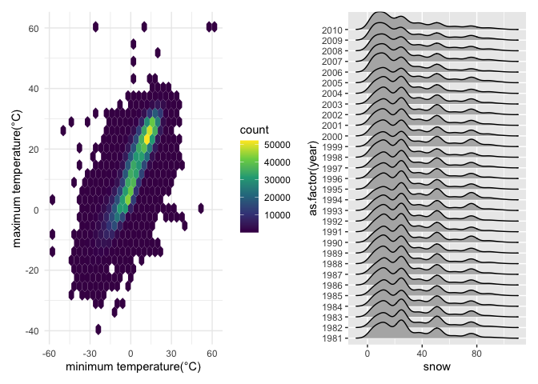

P8015_hw3_dw3093
================
Katherine Wang
2024-10-13

## Question 1

Summary of the dataset This dataset contains `nrow(ny_noaa)` rows and
`ncol(ny_noaa)` columns. This dataset contains 2,595,176 rows and 7
columns The date of observation, ranging from 1981-01-01 to 2010-12-31.

Key variables include: - weather station ID (`id`) - date of observation
(`date`) - precipitation in tenths (mm) (`prcp`) - snowfall (mm)
(`snow`) - snow depth (mm) (`snwd`) - maximum temperature (tenths of
degrees C) (`tmax`) - minimum temperature (tenths of degrees C) (`tmin`)

The `tmax` and `tmin` are set to be character variables, so they need to
converse to numeric variables in the future step.

Through the missing value check, there are a great amount missing (NAs)
values as shown on the table: id date prcp snow snwd tmax tmin 0 0
145838 381221 591786 1134358 1134420

    ##       id                 date                 prcp               snow       
    ##  Length:2595176     Min.   :1981-01-01   Min.   :    0.00   Min.   :  -13   
    ##  Class :character   1st Qu.:1988-11-29   1st Qu.:    0.00   1st Qu.:    0   
    ##  Mode  :character   Median :1997-01-21   Median :    0.00   Median :    0   
    ##                     Mean   :1997-01-01   Mean   :   29.82   Mean   :    5   
    ##                     3rd Qu.:2005-09-01   3rd Qu.:   23.00   3rd Qu.:    0   
    ##                     Max.   :2010-12-31   Max.   :22860.00   Max.   :10160   
    ##                                          NA's   :145838     NA's   :381221  
    ##       snwd             tmax              tmin        
    ##  Min.   :   0.0   Min.   :-389.0    Min.   :-594.0   
    ##  1st Qu.:   0.0   1st Qu.:  50.0    1st Qu.: -39.0   
    ##  Median :   0.0   Median : 150.0    Median :  33.0   
    ##  Mean   :  37.3   Mean   : 139.8    Mean   :  30.3   
    ##  3rd Qu.:   0.0   3rd Qu.: 233.0    3rd Qu.: 111.0   
    ##  Max.   :9195.0   Max.   : 600.0    Max.   : 600.0   
    ##  NA's   :591786   NA's   :1134358   NA's   :1134420

Convert tmax and tmin to numeric variables.

    ## # A tibble: 282 × 2
    ##     snow       n
    ##    <int>   <int>
    ##  1     0 2008508
    ##  2    NA  381221
    ##  3    25   31022
    ##  4    13   23095
    ##  5    51   18274
    ##  6    76   10173
    ##  7     8    9962
    ##  8     5    9748
    ##  9    38    9197
    ## 10     3    8790
    ## # ℹ 272 more rows

The most commonly observed value for snowfall is 0, which indicates that
no snowfall occurred on the majority of days in this dataset that is
2,008,508 observations. This is followed by a large number of NAs,
totaling 381,221 observations, which suggests that snowfall data was not
recorded or available for these entries. Most days in New York State do
not experience snowfall, especially during non-winter months. Therefore,
it is expected that the majority of observations would record 0 for
snowfall, representing days without snow.

``` r
ny_noaa |>
  filter(month==1|month==7)|>
  group_by(id,year,month)|>
  summarise(avg_tmax = mean(tmax, na.rm = TRUE))|>
  ggplot(aes(x = year, y=avg_tmax))+
  geom_point(alpha = .1)+geom_line()+
  facet_grid(.~month)+
  labs( title = "Avg. Max Temperature in Jan and Jul across Years by Station",
    x = "Year",
    y = "avg. max temperature (°C)")+ 
  theme_minimal() + 
  theme(legend.position = "bottom")
```

    ## `summarise()` has grouped output by 'id', 'year'. You can override using the
    ## `.groups` argument.


The two-panel plot shows that avg. max temperatures in January exhibit
more variability across stations and years ranging from about -10°C to
10°C, while July temperatures are relatively stable, consistently around
25°C to 35°C. In January more fluctuations are visible, with few
potential outliers like the lowest temperature is about 13°C in around
1982. July shows minimal variation, the temperature is quite consistency
warm across the years, but still contains few outliers, like the lowest
temperature is about 14°C in around 1988.

``` r
ggp_tmax_tmin=
  ny_noaa|>
  ggplot(aes(x=tmin, y=tmax))+
  geom_hex()+
  labs(
    x = "minimum temperature(°C)",
    y = "maximum temperature(°C)",
    title = "Relationship Between tmax and tmin"
    )+
    theme_minimal()

ggp_snow=
ny_noaa|>
  filter(snow>0, snow<100)|>
  ggplot(aes(x = snow, fill = factor(year))) + 
  geom_density(alpha=.3)+
  labs(title = "Density of Snowfall by Year", x = "snow depth (mm)", y = "year") +
  theme_minimal()

ggp_tmax_tmin + ggp_snow
```


